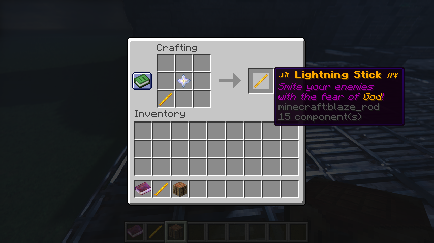

# Lightning Cast Datapack

A Minecraft datapack that introduces Lightning Stick item to summon lightning with right-click.

[Official Modrinth page](https://modrinth.com/project/lightning-cast)

## How to Install

1. Download zip file from [Releases](https://github.com/rainzhao2000/lightning_cast/releases) (NOT THE SOURCE CODE FILES).

2. Move zip file into your world save e.g `.minecraft\saves\yourworld\datapacks\` or new world

3. For new world, you may have to enable the datapack with `/datapack enable`

## How to obtain Lightning Stick

a. Use `/function lightning_cast:stick` command

OR

b. Craft with blaze rod and nether star

